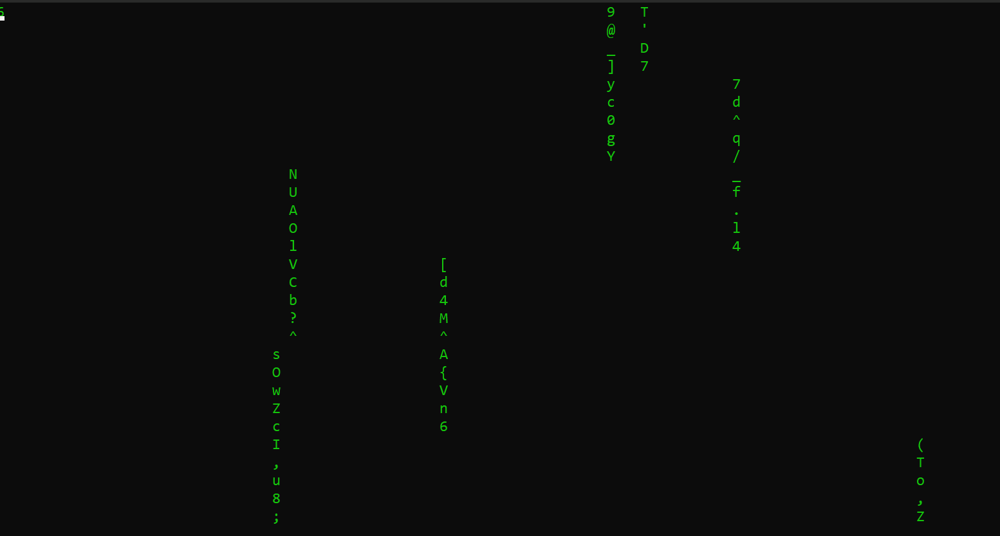
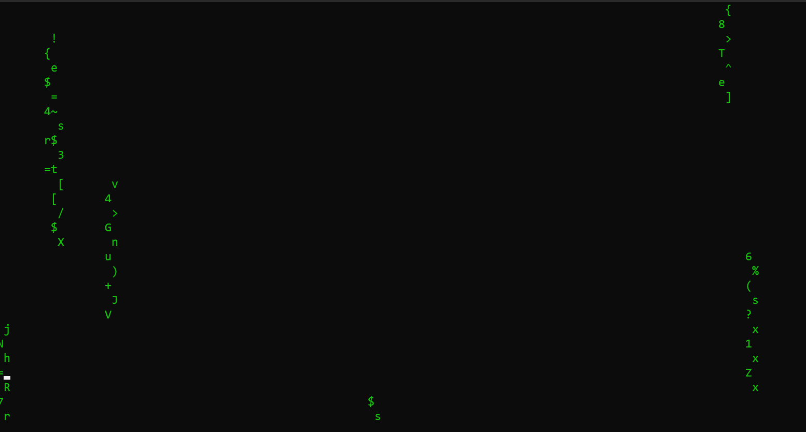
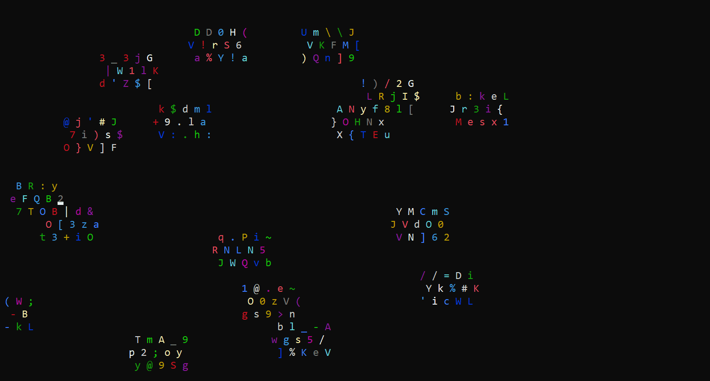
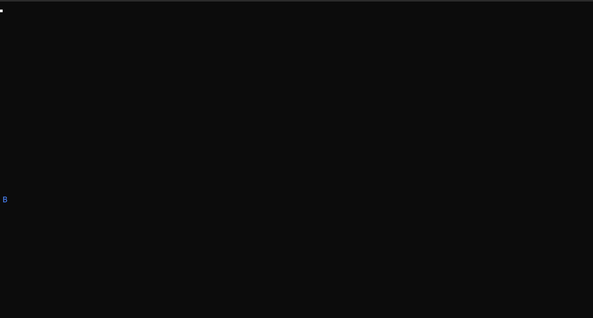
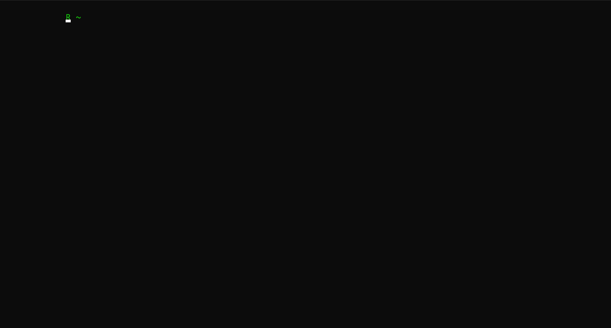
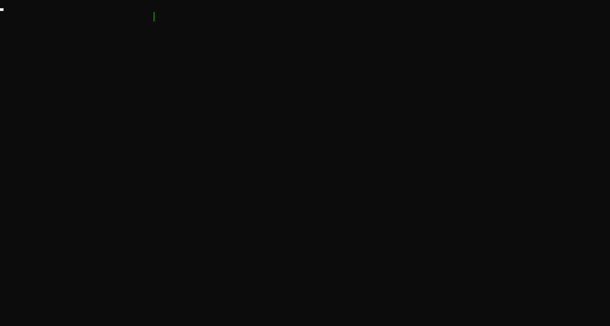
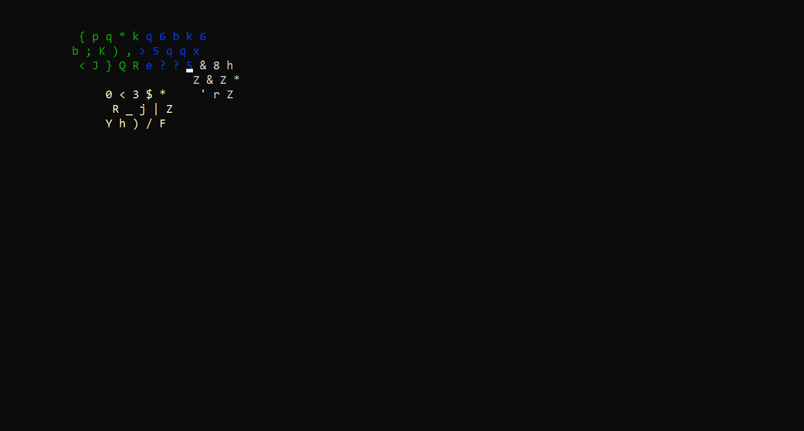
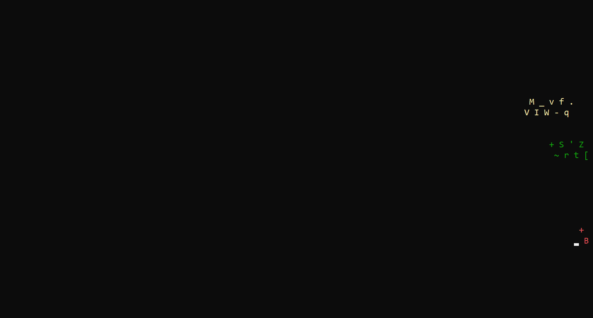

# Лабораторная работа 1

## Условия

[Задание](ООП_ТЗ_Лабораторная_работа_1.docx)

---

## Особенности

Работа с консолью невероятно медленная, но это проблема не языка, а операционных систем. Каждый вызов функции, связанной напрямую с работой с консолью, такой как: изменение цвета, изменение положения курсора, чтение символа, запись символа; приводит к системным вызовам, что требует смены контекста и прочих медленных вещей. Из-за этого данная реализация работает с очень низким FPS, тут используется довольно много системных вызовов, но они все простые.\
Так же, в данной реализации в некоторых системах, особенно в Win10, может происходить странная ситуация, когда программа консоли не успевает реагировать на быстрые команды программы и не выводит некоторые символы или наоборот - не стирает их. Эти баги редкие, но всё же случаются, поэтому есть возможность перед каждым циклом отрисовки выполнить полную очистку консоли. Это уберёт все зависающие символы, но добавит эффект мерцания (простите, эпилептики). Очистка консоли по-умолчанию отключена. В режиме слева направо баги визуально не замечены, можно не включать очистку экрана.

Различное поведение программы отображено в табличке ниже. Для всех примеров задана частота 1, скорость 5, длина 10, а эпилепсия и полная очистка экрана выключены, если не указано обратное.

| Направление | Ромбы | Линии | Зиг-заги |
| :---: | :--- | :--- | :--- |
| `downToUp` |  |  |  |
| `leftToRight` |  |  |  |
| Настройки | `myEpilepsyType{ EpilepsyType::symbol };`<br>`epilepsy_ = true;` | `myEpilepsyType{ EpilepsyType::symbol };`<br>`enableClearScreen{ true };`<br>`epilepsy_ = true;` | `myEpilepsyType{ EpilepsyType::symbol };`<br>`epilepsy_ = true;` |
| `upToDown` |  |  |  |
| `rightToLeft` |  |  |  |
| Настройки | `myEpilepsyType{ EpilepsyType::line };`<br>`enableClearScreen{ true };`<br>`epilepsy_ = true;` | `EpilepsyType::line };`<br>`epilepsy_ = true;` | `myEpilepsyType{ EpilepsyType::line };`<br>`enableClearScreen{ true };`<br>`epilepsy_ = true;` |

Если у Вас наблюдаются баги, включите полную очистку экрана или перейдите в ветку Lab1_doubleBufferisation (пока не готово)

---

## Как скачать

<details>
	<summary>1. Скачать в формате .zip вверху текущей страницы</summary>

Распаковать в удобное место и перейти к разделу "[Как собрать](https://github.com/MaroonSkull/OOP-lab-works--MAI-316kaf-09.03.01-5-semester/tree/Lab1/README.md#%D0%BA%D0%B0%D0%BA-%D1%81%D0%BE%D0%B1%D1%80%D0%B0%D1%82%D1%8C)"
</details>

<details>
	<summary>2. Использовать нативные средства Visual Studio</summary>

При открытии программы выбрать справа Clone Repository, указать [эту ссылку](https://github.com/MaroonSkull/OOP-lab-works--MAI-316kaf-09.03.01-5-semester), в панели инструментов выбрать git->manage branches, развернуть remotes/origin, ПКМ по Lab1->checkout, перейти в Solution explorer и выбрать единственную папку с проектом.
</details>

<details>
	<summary>3. Использовать Git bash или GitHub Desktop</summary>

Но мне лень сейчас описывать эти варианты, так что как-нибудь сами
</details>

---

## Как собрать

Проект написан на C++20 с использованием системы сборки CMake. Это отличается от стандартных проектов Visual Studio, так что можно выбрать один из двух путей

<details>
	<summary>1. Наименее подозрительно, но надо гуглить самостоятельно</summary>
  
*Чтобы вопросов не было, почему это Вы использовали CMake, ведь этому Вас никто не учил (или если установлена относительно старая версия visual studio)*
1. [Скачать CMake](https://cmake.org/download/) (рекомендую секцию latest release -> binary distribution);
2. Установить cmake-gui;
3. Выполнить генерацию solution файла для используемой IDE; (это гуглить, долго расписывать)
4. Запустить сгенерированное решение как свой собственный проект Visual Studio)))
</details>

<details>
	<summary>2. Ленивый путь, но очень подозрительный</summary>
  
*мб придётся объяснять CMake и то, как работает эта система сборки. И работает только в новых версиях Visual Studio (некоторые версии 2017 и новее)*
1. [Добавить поддержку CMake](https://learn.microsoft.com/ru-ru/cpp/build/cmake-projects-in-visual-studio?view=msvc-170) с помощью Visual Studio Installer;
2. Запустить проект как ни в чём не бывало
3. В выпадающем списке вверху выбрать Lab1[.exe]

Можно компилировать
</details>

---

## Как настроить

1. Если будут проблемы с кодировкой файлов в Visual Studio, в Solution explorer выберите файл, ПКМ->Open with->C++ source code editor (with encoding) -> выберите UTF-8 или оставьте auto-detect
2. В файле Globals.hpp укажите параметры, которые соответсвуют вашему варианту, это такие переменные как `myDirection`, `myLineType`, `myEpilepsyType` и `enableClearScreen`
3. Попробуйте запустить проект
4. Если всё запускается, то настало время удалять всё лишнее *для вашего варианта* из кода. Выполните поиск `if constexpr` по всему решению (<kbd>Ctrl</kbd> + <kbd>F</kbd>, Entire solution).
5. Удалите все условные блоки, которые не совпадают с вашим вариантом. Как только останется только то, что вам нужно, можете убрать сами условия `if`. Можно их не убирать, но будет подозрительно. От `constexpr` после `if` тоже лучше избавиться, если не хотите рассказывать на сдаче лабы про compile-time вычисления.

<details>
	<summary>Пример для line, upToDawn</summary>

*Пример метода из класса Line*
До
```C++
void move(double distance) {
	
	// Получаем текущую позицию начала линии
	int16_t x{ static_cast<int16_t>(x_) };
	int16_t y{ static_cast<int16_t>(y_) };
	// Накапливаем смещение
	if constexpr (Global::myDirection == Global::Direction::upToDown)
		y_ += distance;
	else if constexpr (Global::myDirection == Global::Direction::downToUp)
		y_ -= distance;
	else if constexpr (Global::myDirection == Global::Direction::leftToRight)
		x_ += distance;
	else if constexpr (Global::myDirection == Global::Direction::rightToLeft)
		x_ -= distance;
		
	// Вычисляем, на сколько позиций нам надо сместиться
	int16_t stepsY = static_cast<int16_t>(y_) - y; // вертикально
	int16_t stepsX = static_cast<int16_t>(x_) - x; // горизонтально
	...
}
```
После
```C++
void move(double distance) {
	
	// Получаем текущую позицию начала линии
	int16_t x{ static_cast<int16_t>(x_) };
	int16_t y{ static_cast<int16_t>(y_) };
	// Накапливаем смещение
	y_ += distance;
		
	// Вычисляем, на сколько позиций нам надо сместиться
	int16_t stepsY = static_cast<int16_t>(y_) - y; // вертикально
	int16_t stepsX = static_cast<int16_t>(x_) - x; // горизонтально
	...
}
```
</details>

Если Вы, уважаемый мой одногруппник, справитесь и удалите все условия, то стоит удалить и все enum class из файла globals.hpp, что уменьшит подозрительность (В идеале, конечно, ещё и от файла globals.hpp избавиться, или оставить там только функции)

---

## Как это работает

